# AutoDrafter 系統流程圖

## 1. 主流程（Main Flow）

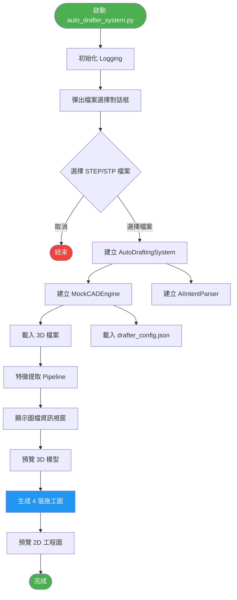

## 2. 檔案載入流程（File Loading）

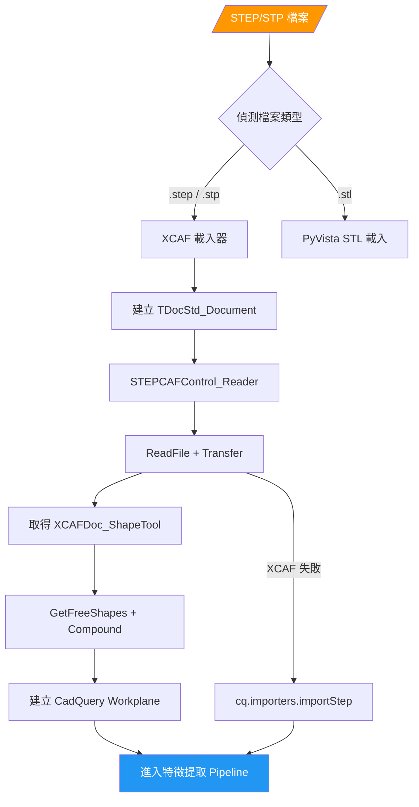

## 3. 特徵提取 Pipeline（Feature Extraction）

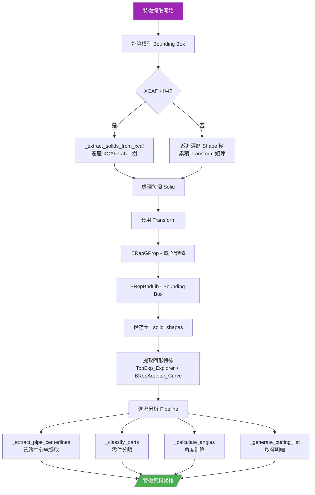

## 4. 管路中心線提取（Pipe Centerline Extraction）

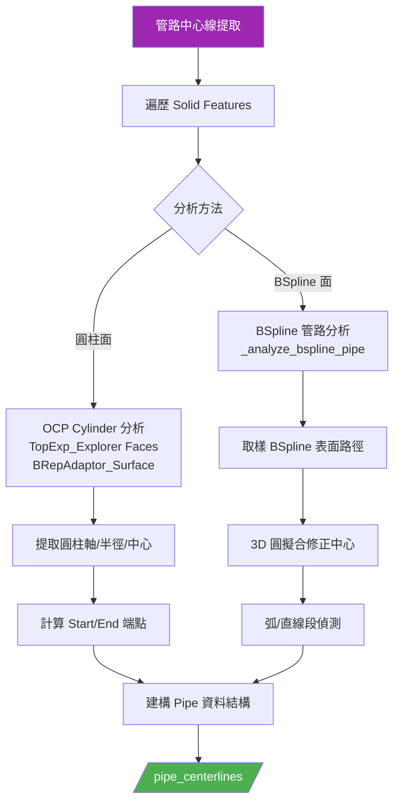

## 5. 零件分類規則（Part Classification）

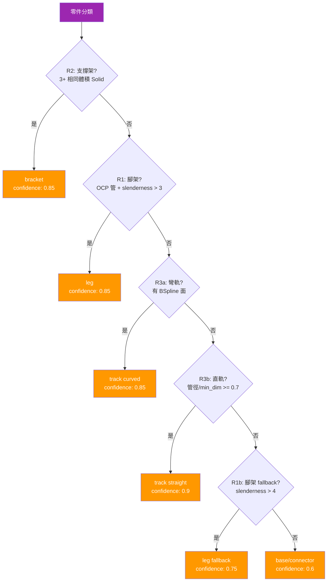

## 6. 施工圖生成流程（Drawing Generation）

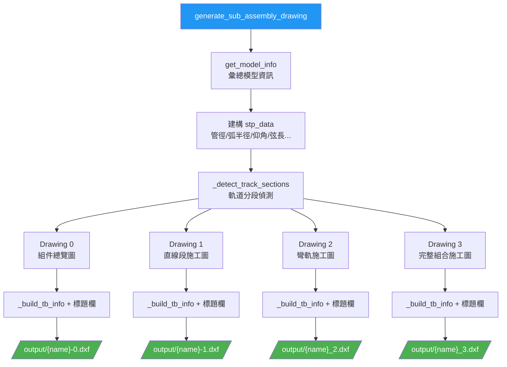

## 7. 各 Drawing 內容與標註旗標

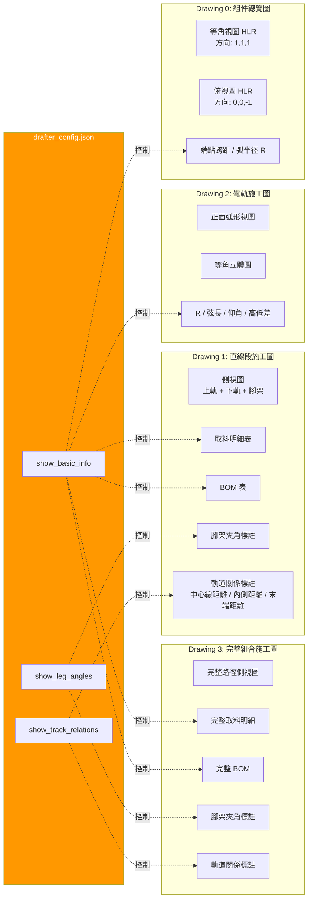

## 8. 標題欄優先順序（Title Block Priority）

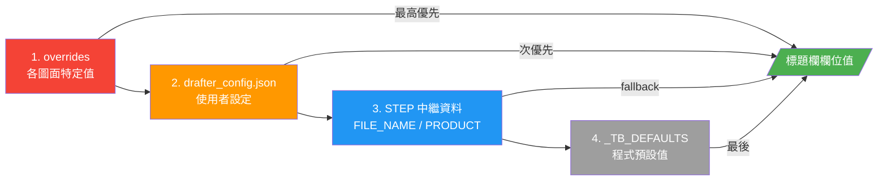

## 9. 3D 間距推算流程（Track Gap Calculation）

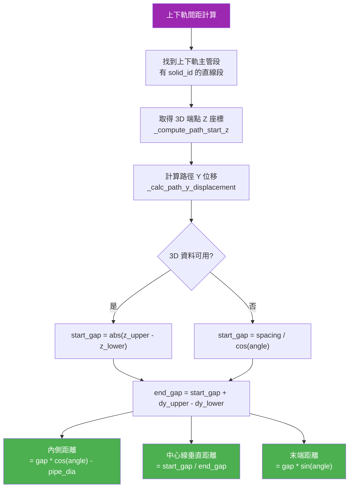

## 10. 完整資料流（Data Flow）

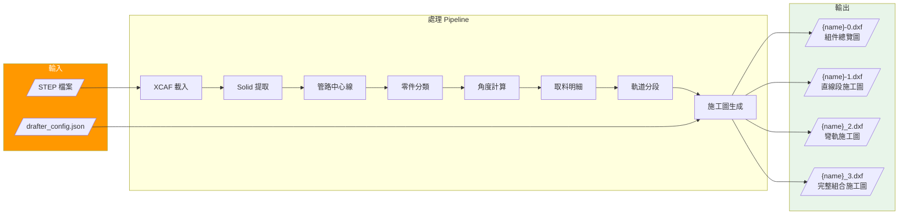

## 11. 類別關係圖（Class Diagram）

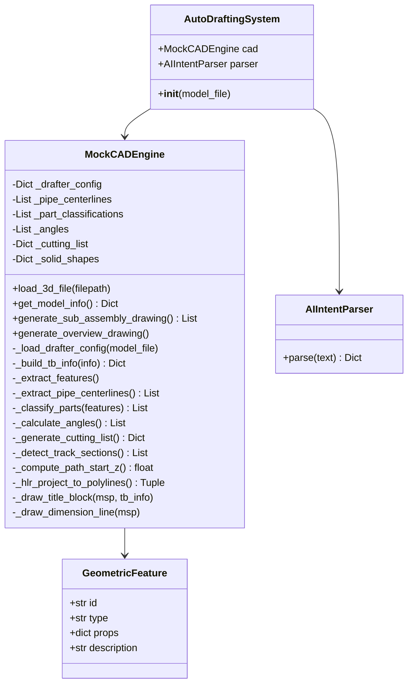

## 12. 完整呼叫鏈（Call Chain）

```
main()
+-- select_3d_file()
+-- AutoDraftingSystem.__init__()
|   +-- MockCADEngine.__init__()
|   |   +-- load_3d_file()
|   |   |   +-- _load_step_with_xcaf()  [or fallback]
|   |   |   +-- _extract_features()
|   |   |       +-- _extract_solids_from_xcaf()  [or recursive traversal]
|   |   |       +-- _extract_pipe_centerlines()
|   |   |       |   +-- _analyze_bspline_pipe()  [for BSpline]
|   |   |       +-- _classify_parts()
|   |   |       +-- _calculate_angles()
|   |   |       +-- _generate_cutting_list()
|   |   |           +-- _build_track_items()
|   |   +-- _load_drafter_config()
|   +-- AIIntentParser.__init__()
+-- system.cad.get_model_info()
|   +-- _extract_step_metadata()
|   +-- _parse_step_materials()
|   +-- _parse_step_solid_entities()
+-- system.cad.preview_3d_model()
+-- system.cad.generate_sub_assembly_drawing()
    +-- get_model_info()
    +-- _detect_track_sections()
    +-- generate_overview_drawing()         [Drawing 0]
    |   +-- _build_tb_info()
    |   +-- _hlr_project_to_polylines()     [isometric]
    |   +-- _hlr_project_to_polylines()     [top view]
    |   +-- _draw_title_block()
    +-- _draw_straight_section_sheet()      [Drawing 1]
    |   +-- _build_section_cutting_list()
    |   +-- _compute_path_start_z()         [3D gap]
    |   +-- _draw_title_block()
    +-- generate_curved_track_drawing()     [Drawing 2]
    |   +-- _hlr_project_to_polylines()
    |   +-- _draw_title_block()
    +-- generate_section_assembly_drawing() [Drawing 3]
        +-- _draw_rail_path()
        +-- _draw_cutting_list_table()
        +-- _draw_bom_table()
        +-- _draw_title_block()
```
